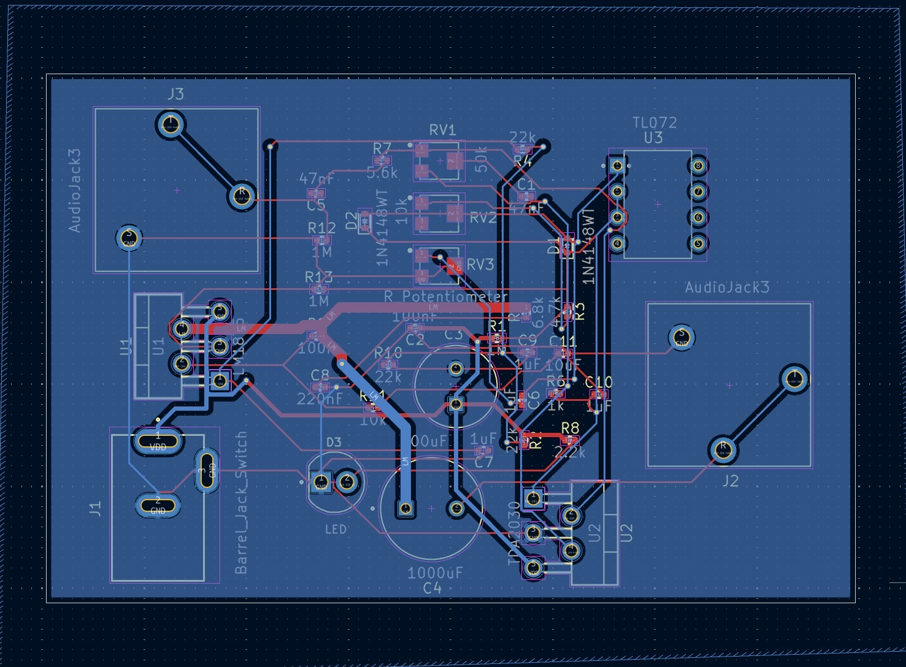

### **Personal Project: Guitar Amplifier**
For this project, Ioannis and Daniel collaborated to design a guitar amplifier. We learned to use KiCad, an open-source software, to create a printed circuit board (PCB) compatible with an electric guitar to amplify its output volume.

This project is made up of two phases, with the first one being the **Creation of the PCB**  and the second being the **Testing** phase.

**Creation of the PCB:** We have created the PCB of the guitar amplifier on KiCad, as it took us around three weeks to make. During this period, we ran into a few problems, specifically with the types of components we were considering to use. The components of an operational amplifier, power barrel connector, audio jack, and potentiometer were the main issues that arose. But eventually, we were able to find compatible components that we could use on our PCB. As these components are the most compatible that solved the main issues: 

Operational amplifier = TL072 Lo/Noise 2XJFET Op. Amplifier

Power barrel connector = DCJ200-10-A-K1-K

Audio jack = RJ3VM

Potentiometer = TC33X-2-103E

<ins> This is the KiCad file for the PCB: </ins>          
https://github.com/ioannis-0/Guitar-Amplifier/tree/main/Final%20personal%20project

<ins> Image of the PCB on KiCad: </ins>  

**Testing:** We decided to test the PCB on an electric guitar, which is the Squier Sonic Stratocaster. The testing we conducted on this electric guitar was a success, as we were able to increase the volume output of the guitar using the PCB we had created. As no serious problems occurred during the testing phase.

<ins> Image of the testing of the PCB: </ins>  
https://www.youtube.com/watch?v=hHbWF1Bvgf4

<ins> Image of the physical PCB: </ins>  

<ins> For a detail timeline and understanding of the project you can visit here: </ins>                                                  
https://github.com/ioannis-0/Guitar-Amplifier/projects?query=is%3Aopen
